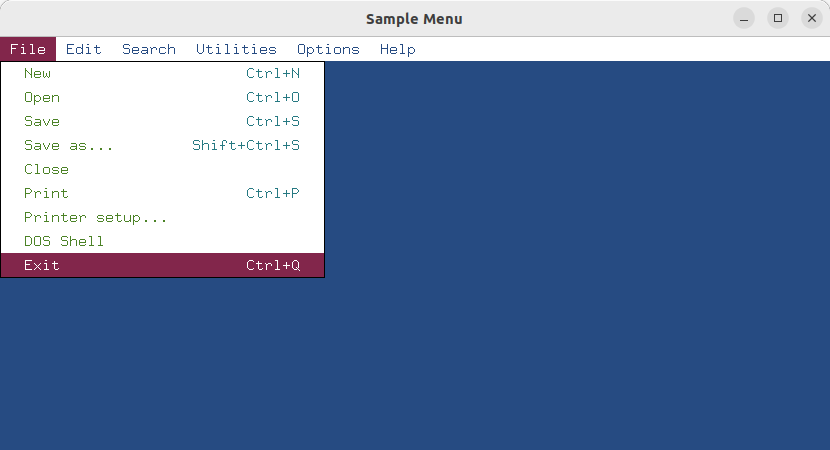

# Graphics Library with Glyph Bitmap Distribution Format (glbdf)

`glbdf` is a simple graphics library designed for rendering fixed-width Bitmap Distribution Format (BDF) fonts. Built upon `GLFW`,
it aims to provide an easy and understandable abstraction layer for `OpenGL`. This versatile library can be used for creating a
wide range of applications, from simple games to more complex business software.

### Getting Started

For more info see [getting started](docs/README.md).

### Example

Sample Menu [menu.c](tests/menu.c)

